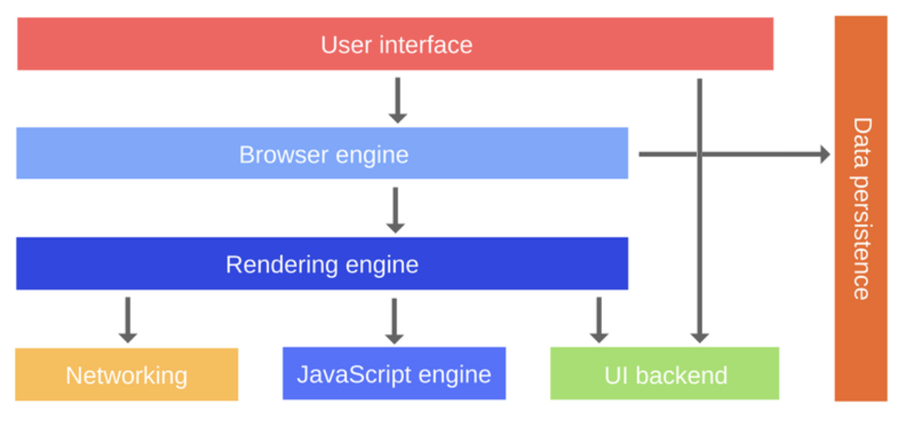

## JavaScript 렌더링

위 그림은 브라우저 기본 구성 요소를 나타낸다.

- User interface (사용자 인터페이스) : 주소 표시줄, 뒤로 및 앞으로 버튼, 책갈피 메뉴 등을 포함한다. 본질적으로, 웹 페이지 자체를 보는 창을 제외한 모든 브라우저 디스플레이 부분이다.

- Browser engine (브라우저 엔진) : 사용자 인터페이스와 렌더링 엔진 간의 상호 작용을 처리한다.

- Rendering engine (렌더링 엔진) : 웹 페이지를 표시하는 역할을 한다. 렌더링 엔진은 HTML과 CSS를 파싱하고 파싱된 콘텐츠를 화면에 표시한다.

- Networking (네트워킹) : 다른 구현법을 사용해서 만든 각기 다른 플랫폼들 (뒤에 독립적 인터페이스를 가진) 의 XHR 요청과 같은 네트워크 호출을 뜻한다.

- UI backend : 확인란이나 창과 같은 핵심 위젯을 그리는데 사용된다. UI 벡엔드는 플랫폼에 특정되지 않은 일반적인 인터페이스를 제공한다. 내부 운영체제 UI 방식을 사용한다.

- JavaScript engine (자바스크립트 엔진) : 여기서 자바스크립트가 실핸된다.

- Data persistence (데이터 지속성) : 앱은 모든 데이터를 로컬에 저장해야 할 수도 있다. 지원되는 스토리지 메커니즘 유형에는 localStorage, indexDB, WebSQL 및 FileSystem이 포함된다.

---

### 렌더링 엔진 개요

렌더링 엔진의 주된 책임은 브라우저 화면에 요청된 페이지를 표시하는 것이다.

렌더링 엔진은 HTML과 XML 문서와 이미지를 표시할 수 있다. 추가 플러그인을 사용하는 경우 엔진은 PDF와 같은 다양한 유형의 문서를 표시할 수도 있다.

---

### 렌더링 엔진

자바스크립트 엔진과 유사하게, 다른 브라우저들도 다른 렌더링 엔진을 사용한다.
아래 몇가지 예시

Gecko — Firefox\
WebKit — Safari\
Blink — Chrome, Opera (버전 15 이후)

---

### 렌더링 프로세스
렌더링 엔진은 네트워킹 계층으로부터 요청된 문서의 내용을 수신한다.

1. HTML 문서를 가져와서 돔 트리를 구성
2. 랜더 트리를 구성
3. 렌더 트리를 배치
4. 렌더 트리를 꾸미기

---

### 렌더링 성능 최적화
앱을 최적화하려면 생각해야되는 5가지

1. JavaScript - 렌더링과 관련하여, 자바스크립트 코드가 페이지의 DOM 요소와 상호작용하는 방법에 대해 생각해야한다. (특히 SPA에서 UI에 많은 변화를 일으킬 수 있다.)

2. 스타일 계산 - CSS 규칙이 적용되는지 결정하는 과정, 규칙이 정의되면 규칙이 적용되고 난 뒤 각 요소의 최종 스타일이 계산된다.

3. 레이아웃 - 브라우저가 요소에 적용되는 규칙을 알고, 브라우저 화면에 차지하는 공간과 그 공간이 위치한 위치를 계산하기 시작할 수 있다. 웹의 레이아웃 모델은 한 요소가 다른 요소에 영향을 미칠 수 있다고 정의한다. 예를 들어 `<body>`의 폭은 그 자식의 폭 등에 영향을 미칠 수 있다. 이것은 모두 배치 과정이 계산적으로 집약적이라는 것을 의미한다. 도면은 여러 겹으로 되어 있다.

4. 그림판 - 실제 픽셀이 채워지는 곳이다. 이 과정에는 텍스트, 색상, 이미지, 경계, 그림자 등을 그리는 것이 포함된다.\
페이지 부분이 잠재적으로 여러 레이어로 그려졌으므로 올바른 순서로 화면에 그려야 페이지가 제대로 렌더링될 수 있다. 이것은 특히 겹치는 요소들에 있어서 매우 중요하다.

5. JavaScript 최적화
자바스크립트는 종종 브라우저에서 시각적 변화를 촉발한다. SPA를 만들 때는 더욱 그렇다.

---

### 렌더링을 개선하기 위해 최적화할 수 있는 JavaScript 몇 가지 팁

- 시각적 업데이트에 대해서는 setTimeout 또는 setInterval을 사용금지.

- 오랫동안 실행 중인 JavaScript 계산을 웹 작업자로 이동. dom 의 시각적 업데이트의 처음과 끝만 시각적 변화 작업을 하기.

- 마이크로 작업을 사용하여 여러 프레임에 대한 DOM 변경 사항을 정하기.

> 이 문서는 "Alexander Zlatkov"의 글 중 일부를 번역한 글입니다.

> 원본 글 출처 : https://blog.sessionstack.com/how-javascript-works-the-rendering-engine-and-tips-to-optimize-its-performance-7b95553baeda

